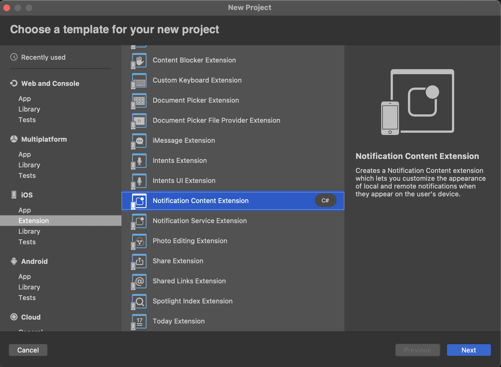
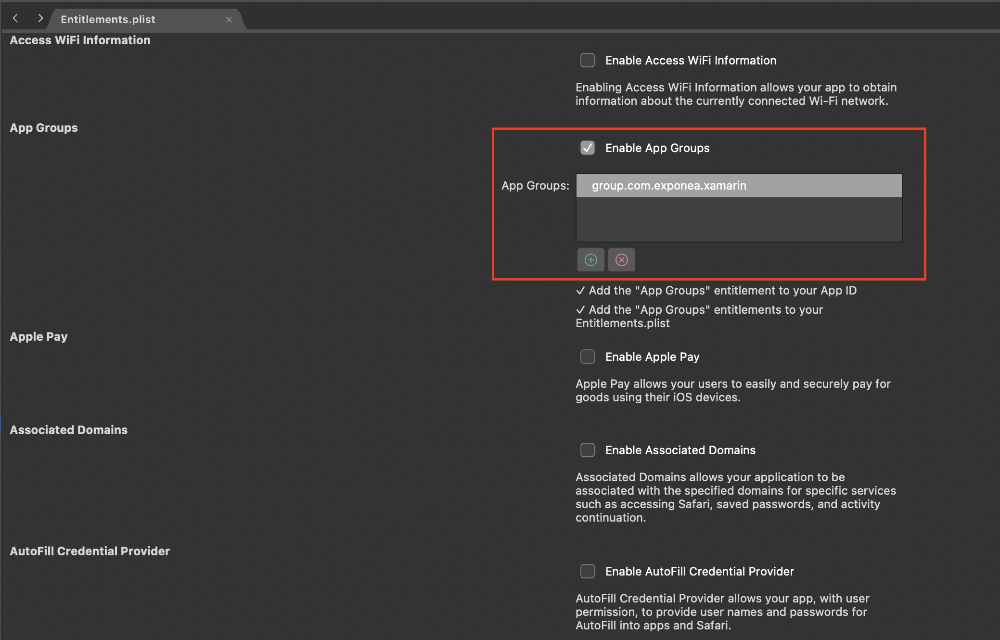
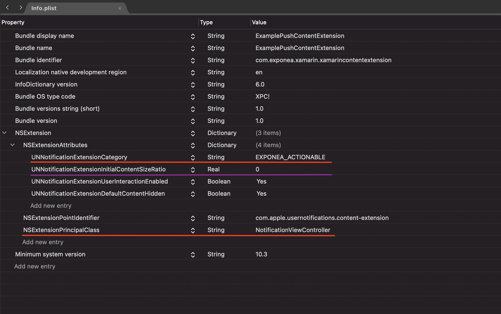

## 📣  Push Notifications

Exponea allows you to easily create complex scenarios which you can use to send push notifications directly to your customers. The following section explains how to enable push notifications for iOS.

  
## Quickstart

For push notifications to work, you'll need to set up a few things:

- create an Apple Push Notification service(APNs) key

- integrate push notifications into your application

- set the APNs key in the Exponea web app

  

We've created a [Quick start guide](#quick-start-guide) to guide you through these steps.

  

## Handling push notification opening

Exponea SDK contains a delegate base class with already implemented push opening logic. To handle push notification opening, use ExponeaAppDelegate ( or ExponeaFormsAppDelegate ) as your application delegate base class.

```csharp

[Register("AppDelegate")]

public partial class AppDelegate : ExponeaFormsAppDelegate {

    public override bool FinishedLaunching(UIApplication app, NSDictionary launchOptions) {
        Forms.Init();
        DependencyService.Register<Exponea.IExponeaSdk, Exponea.ExponeaSdk>();
        LoadApplication(new App());
        return base.FinishedLaunching(app, launchOptions);
    }
}

```

  

## Tracking delivered notifications

Notification service extension is required for tracking push notification delivery. This extension is part of the Rich notifications setup described in [Quick start guide](#quick-start-guide).

  

## Silent push notifications

Exponea SDK supports both regular "alert" push notifications and silent push notifications(Background Updates). To receive a notification, you need to track your push token to the Exponea backend. When push notification tracking is enabled and properly implemented, this will happen automatically. By default, the token is only tracked when the app is authorized to receive *_alert_* push notifications. You can change this by setting the configuration variable `requirePushAuthorization = false`. With this setting, the SDK will register for push notifications and track the push token at the application start. Push notification authorization status is tracked as customer property `apple_push_notification_authorized`.

  

``` csharp

var config = new Configuration("project-token", "your-auth-token", "https://api.exponea.com");

config.iOSConfiguration = new iOSConfiguration(appGroup: "group.your.app.group", requirePushAuthorization: false);

_exponea.Configure(config);

```

> Silent push notifications require `Background Modes` `Remote notifications` capability.


## Multiple push notification sources

The SDK only handles push notifications coming from the Exponea backend. If you use other servers than Exponea to send push notifications, you'll need to implement some of the logic yourself.


### Conditional processing

[Quick start guide](#quick-start-guide) describes delegates/extensions required for Exponea push notification handling to work. You can use the method `ExponeaNotificationHandler.Instance.IsExponeaNotification(userInfo:)` in the delegate/extension implementations to check if the notification being processed is coming from Exponea servers and either call Exponea method or process the notification using implementation for other push notification source.

  

### Manual tracking

You can completely disable notification tracking and use methods `_exponea.TrackPushToken` and `_exponea.Track(Click click)` to track push notification events.  You can always track `campaign` event manually with Track(Event event) and any payload you need.

  

# Quick start guide

  

> To send push notifications, we need to track Firebase token to Exponea servers. So please make sure [tracking](./TRACK.md) is working before configuring push notifications.


## Setup process

1. [Setting application capabilities](#1-application-capabilities)

2. [Updating Exponea configuration](#2-configuration)

3. [Implementing application delegate methods](#3-application-delegate-methods)

4. [Configuring Exponea to send push notifications](#4-configuring-exponea-to-send-push-notifications)

5. [Authorizing the application for receiving push notifications](#5-authorizing-for-receiving-push-notifications)

6. [Rich push notifications](#6-rich-push-notifications)(optional)

  

## 1. Application capabilities

You need to set up capabilities for your application. To do so, select your application in XCode, go to `Signing & Capabilities`, and add capabilities:

- `Push Notifications` is required for alert push notifications.

- `Background Modes` and select `Remote notifications` required for silent push notifications.

- `App Groups` and create a new app group for your app. This is required for application extensions that will handle push notification delivery and rich content.

  

> To add `Push Notifications` capability, your Apple developer account needs to have paid membership. Without it, the capability selector doesn't contain this capability at all.


## 2. Configuration

To enable push notifications, configure the SDK with `iOSConfiguration`, use the app group created in the previous step.

``` csharp

var config = new Configuration("project-token", "your-auth-token", "https://api.exponea.com");

config.iOSConfiguration = new iOSConfiguration(appGroup: "group.your.app.group");

_exponea.Configure(config);

```

## 3. Application delegate methods

The application needs so to be able to respond to push notification-related events.

You will need to set up three delegate methods:

- `RegisteredForRemoteNotifications` will be called when your application registers for push notifications.

- `DidReceiveRemoteNotification` will be called for silent push notifications and alert push notifications when your app is opened.

- `DidReceiveNotificationResponse` will be called when a user opens an alert push notification.

  

Exponea SDK contains `ExponeaAppDelegate` (or `ExponeaFormsAppDelegate` if you need to inherit from `FormsApplicationDelegate` ) that contains the implementation of these methods. The easiest way to integrate is to make your `AppDelegate` extend `ExponeaAppDelegate`. If you don't want to/cannot use `ExponeaAppDelegate`, check the implementation of those methods and call respective Exponea methods of `ExponeaNotificationHandler`  from  `Exponea.iOS` namespace.

  

``` csharp

[Register("AppDelegate")]

public partial class AppDelegate : ExponeaFormsAppDelegate {

    public override bool FinishedLaunching(UIApplication app, NSDictionary launchOptions){

            Forms.Init();
            DependencyService.Register<Exponea.IExponeaSdk, Exponea.ExponeaSdk>();

            //configure Exponea SDK here, if possible

            var config = new Configuration("project-token", "your-auth-token", "https://api.exponea.com");
            config.iOSConfiguration = new iOSConfiguration(appGroup: "group.your.app.group");

            DependencyService.Get<IExponeaSdk>().Configure(config);
            LoadApplication(new App());
            return base.FinishedLaunching(app, launchOptions);
    }
}

```

#### Checklist:

- your `RegisteredForRemoteNotifications` delegate method calls `HandlePushNotificationToken`

- your `DidReceiveRemoteNotification` and `DidReceiveNotificationResponse` calls `HandlePushNotificationOpened`

- you call `UNUserNotificationCenter.Current.Delegate = this;`

  

## 4. Configuring Exponea to send push notifications

To send push notifications from the Exponea backend, you need to connect the Exponea web application to the Apple Push Notification service. To do so, open Project settings in your Exponea app and navigate to Channels/Push notifications. Fill in all the field: `Team ID`, `Key ID`, `ES256 Private Key`, and `Application Bundle ID`.


[Exponea web app push notification configuration](./APNS.md) guide contains screenshots showing where the data is located.

  

## 5. Authorizing for receiving push notifications

You can receive silent push notifications without any permissions, but you'll need special permission for messages visible to the user.

``` csharp
public void RegisterForRemoteNotifications()
        {
            if (UIDevice.CurrentDevice.CheckSystemVersion(8, 0))
            {
                var pushSettings = UIUserNotificationSettings.GetSettingsForTypes(
                                   UIUserNotificationType.Alert | UIUserNotificationType.Badge | UIUserNotificationType.Sound,
                                   new NSSet());

                UIApplication.SharedApplication.RegisterUserNotificationSettings(pushSettings);
                UIApplication.SharedApplication.RegisterForRemoteNotifications();
            }
            else
            {
                UIRemoteNotificationType notificationTypes = UIRemoteNotificationType.Alert | UIRemoteNotificationType.Badge | UIRemoteNotificationType.Sound;
                UIApplication.SharedApplication.RegisterForRemoteNotificationTypes(notificationTypes);
            }
        }
```


#### Checklist:

- Exponea should now be able to send push notifications to your device. To learn how you can check the [Sending Push notifications](./PUSH_SEND.md) guide. A push notification will not display rich content just yet. We'll set it up in the next step.


## 6. Rich push notifications

iOS application needs two application extensions to be able to show custom image and buttons in push notifications. To create an extension, select `Add/New Project/iOS Extension`

>  Make sure that the `iOS Deployment Target` of your extensions is the same as the target for your main app. Visual Studio will set it to the latest when creating extensions.



### Notification Service Extension

Create a new Notification Service Extension and give it `App Groups` capability selecting the group you created for your main app.



In the extension, you have to call Exponea methods for processing notifications and handling timeouts. For iOS extensions, separate App-Extension safe dependency was created. Use ExponeaSDK.iOS.Notifications package as dependecy in extensions.

``` csharp

using System;
using Foundation;
using UserNotifications;
using ExponeaSdkNotifications;

namespace ExamplePushServiceExtension
{
    [Register("NotificationService")]
    public class NotificationService : UNNotificationServiceExtension
    {

        ExponeaNotificationHandler notificationHandler = new ExponeaNotificationHandler("group.com.exponea.xamarin");

        #region Constructors
        protected NotificationService(IntPtr handle) : base(handle)
        {
            // Note: this .ctor should not contain any initialization logic.
        }
        #endregion

        #region Override Methods
        public override void DidReceiveNotificationRequest(UNNotificationRequest request, Action<UNNotificationContent> contentHandler)
        {
            notificationHandler.HandleNotificationRequest(request, contentHandler);
        }

        public override void TimeWillExpire()
        {
            notificationHandler.TimeWillExpire();
        }
        #endregion
    }
}

```

### Notification Content Extension

Create a new Notification Content Extension. By default, the extension will contain a storyboard file that you can delete; we'll change the default view controller implementation. The service extension that we created in the previous step will change the notification `categoryIdentifier` to `EXPONEA_ACTIONABLE`. We have to configure the content extension to display push notifications with that category. Open `Info.plist` in created content extension group and add `UNNotificationExtensionCategory`. Next, remove `NSExtensionMainStoryboard` and instead use `NSExtensionPrincipalClass` set to your view controller.

Notice the parameter `UNNotificationExtensionInitialContentSizeRatio` (with the default value 1). It specifies the ratio between the width and the height of the content in the push notification. By default, the content is as high as it's wide. This setting is not part of the SDK, but it can cause showing white space when notification is without the content (image). Change this value to 0 if you want the height to be dynamic (it will grow to the needed height if there is an image present, but there will be no blanc space if there is not).

  
We also recommend to set `UNNotificationExtensionUserInteractionEnabled` and `UNNotificationExtensionDefaultContentHidden` attributes to true.

  



  

Your view controller class should just forward the notification to our service that will correctly display it.

``` csharp
using System;
using Foundation;
using UIKit;
using UserNotifications;
using UserNotificationsUI;
using ExponeaSdkNotifications;


namespace ExamplePushContentExtension
{

    public partial class NotificationViewController : UIViewController, IUNNotificationContentExtension
    {

        ExponeaNotificationHandler notificationHandler = new ExponeaNotificationHandler("group.com.exponea.xamarin");

        #region Constructors
        protected NotificationViewController(IntPtr handle) : base(handle)
        {
            // Note: this .ctor should not contain any initialization logic.
        }
        #endregion

        #region Override Methods
        public override void ViewDidLoad()
        {
            base.ViewDidLoad();

            // Do any required interface initialization here.
        }
        #endregion

        #region Public Methods
        [Export("didReceiveNotification:")]
        public void DidReceiveNotification(UNNotification notification)
        {
           notificationHandler.HandleNotificationReceived(notification, ExtensionContext, this);
        }
        #endregion
    }
}

```

#### Checklist:

- push notification with image and buttons sent from the Exponea web app should be properly displayed on your device. Push delivery tracking should work.

- if you don't see buttons in the expanded push notification, it means the content extension is ****not**** running. Double-check `UNNotificationExtensionCategory` in the Info.plist - notice the placement inside `NSExtensionAttributes`. Check that the `iOS Deployment Target` is the same for extensions and the main app.

## Great job!

You should now be able to use Exponea push notifications.


To further configure push notifications, check the complete documentation for [Configuration](./CONFIG.md).
