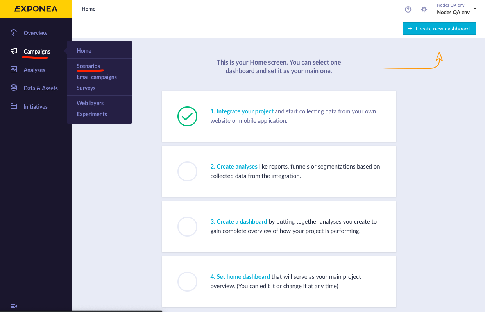
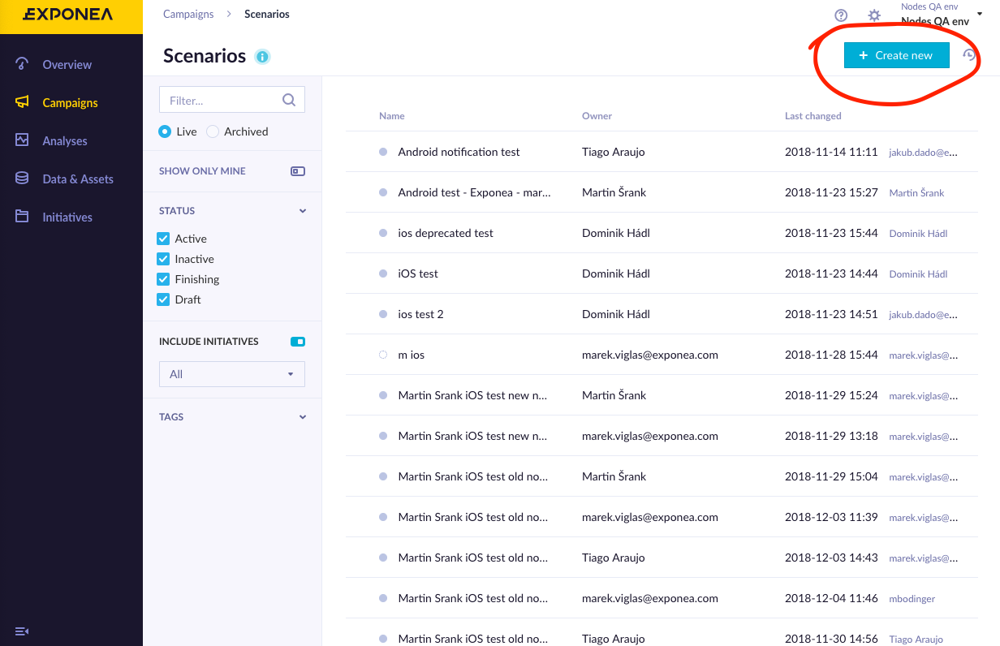
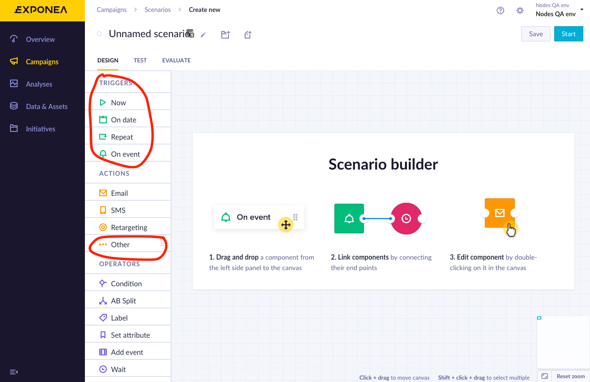
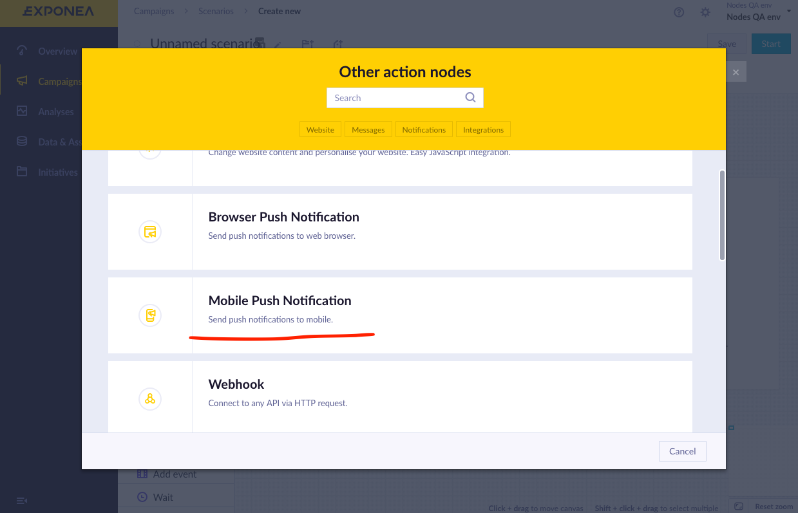
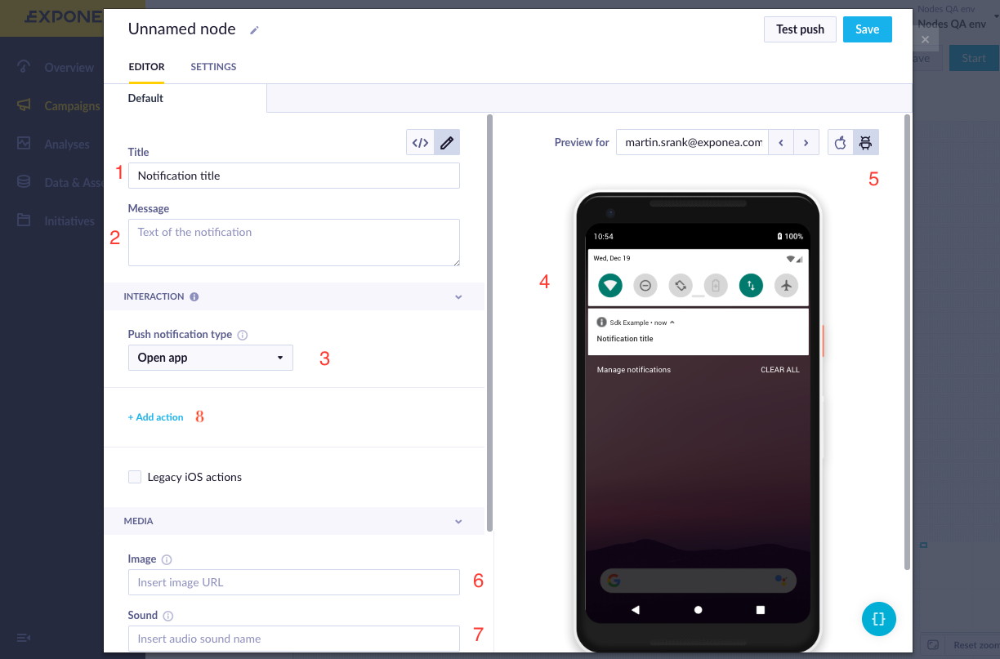
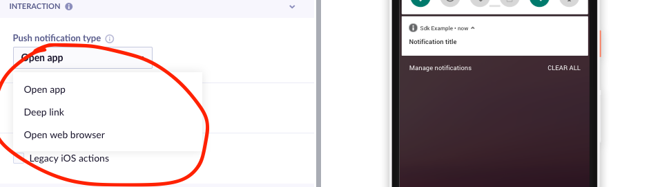
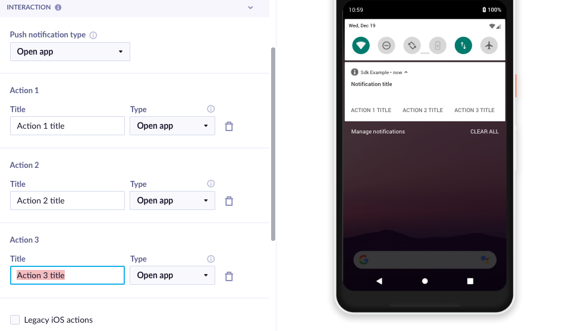
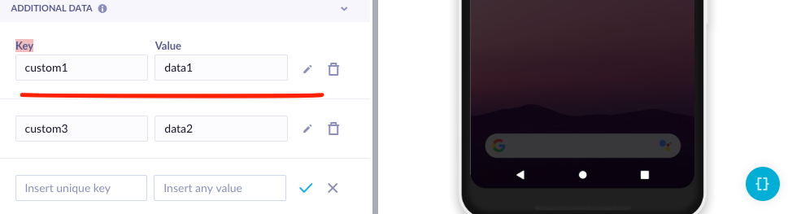

# Sending Push notifications

## Payload constructing
Exponea web app provides a great notifications builder, where you can customize all the interaction and how it will be presented to users.

1. First open Exponea Web App and choose **Campaigns->Scenarios** from the left menu

  

2. To create a new Campaign, press **Create new** button

  

3. This will open a **Campaign Builder** where you can specify when/how your push notification is triggered
You will need to choose a trigger and action type. To locate mobile push notification action
use **Actions->Others** and choose **Mobile Push Notifications** in pop-up menu

  

  


4. This will open notification builder. There you can specify **Title** (1) and **Message** (2) for your notification. There is a **Preview** (4) on the right side that will show what the notification is going to look like. There is also an option to specify an **Image (6)** you want to display and **Sound (9)** that will be played when notification is received.

> When specifying the sound, provide sound name without extension.



5. You can also select **Interaction** performed when a user opens the notification (3). There are three options available:
  * Open Application
  * Open Browser
  * Open Deeplink

  

6. Additionally, you can specify more **Interactions** by Pressing **Add Action button (8)**



8. Lastly, you can specify additional **Data** you want to send using key-value pairs



## Sending a test push notification
First you'll need to identify your test user with email address. Run the following code in your app:
``` swift
 _exponea.IdentifyCustomer(new Customer("testUser") { ["email"] = "test@test.com" });
```

Then select the user by email in the notification builder preview, select iOS platform, and click **Test push notification** button. The push notification should arrive on your device shortly. Keep in mind push notifications only work on an actual device, not on Simulator.